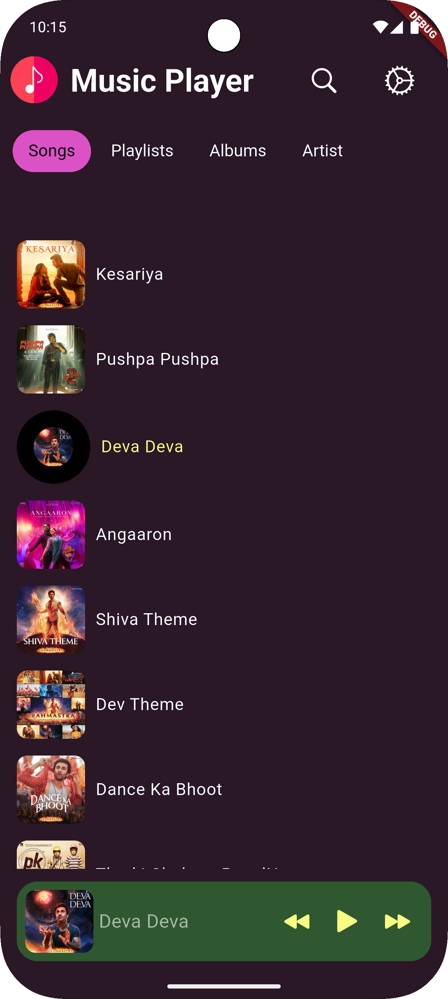
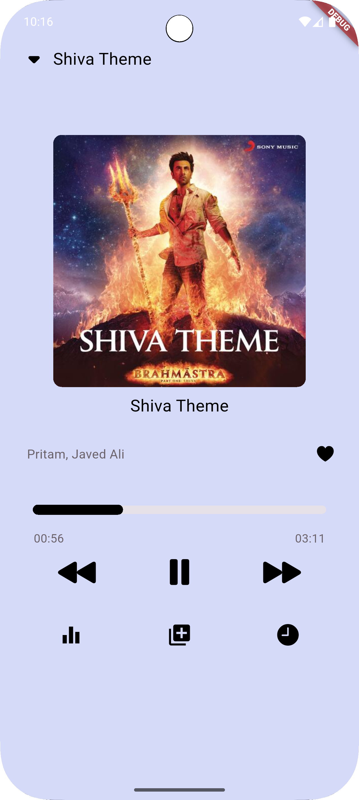
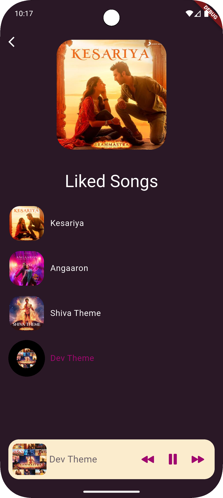
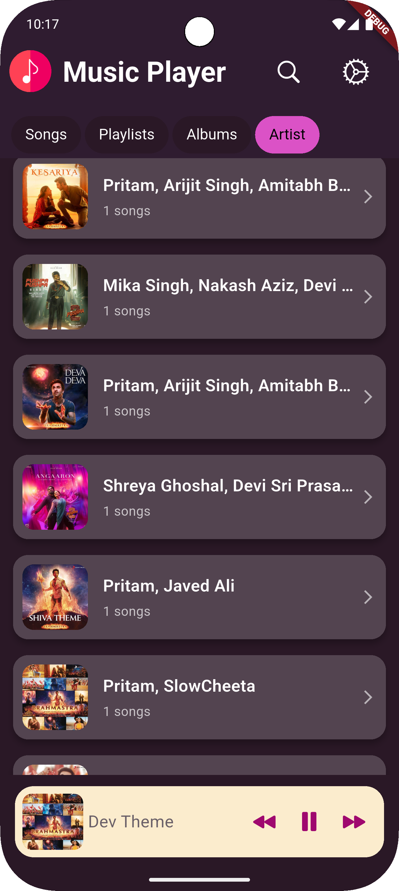
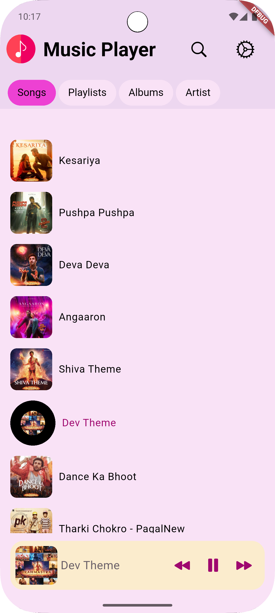

# 🎵 My Music App

A simple and beautiful music player app built with Flutter. Enjoy your favorite songs with a smooth and interactive UI.

## 📸 Screenshots











## 🚀 Features
- Play, pause, and stop music
- Seek forward and backward
- Display song details (title, artist, duration)
- User-friendly UI


## 📂 Installation
1. Clone the repository:
   ```sh
   git clone https://github.com/sahil-Parmar1/music_app.gitrm -rf .git

   ```
2. Navigate to the project directory:
   ```sh
   cd music_app
   ```
3. Install dependencies:
   ```sh
   flutter pub get
   ```
4. Run the app:
   ```sh
   flutter run
   ```

## 🛠️ Dependencies
```yaml
dependencies:
  flutter:
    sdk: flutter
  audioplayers: ^6.4.0
```


Feel free to contribute to this project by submitting issues or pull requests!
